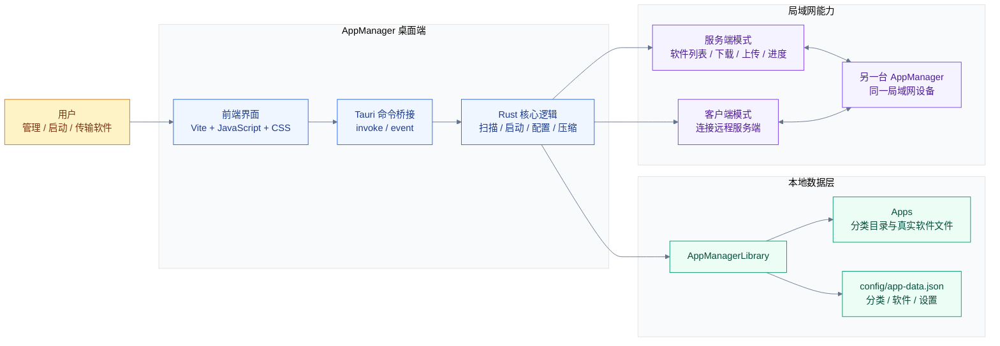
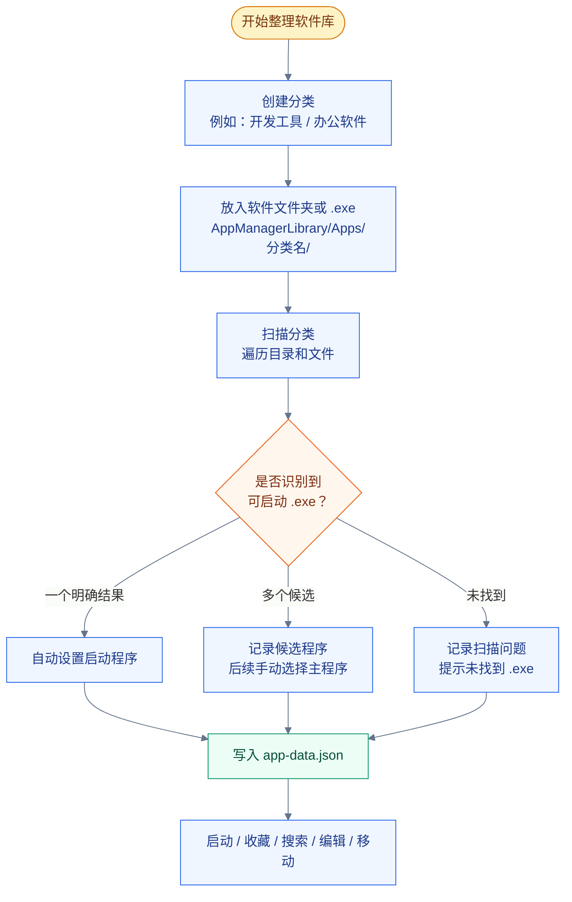
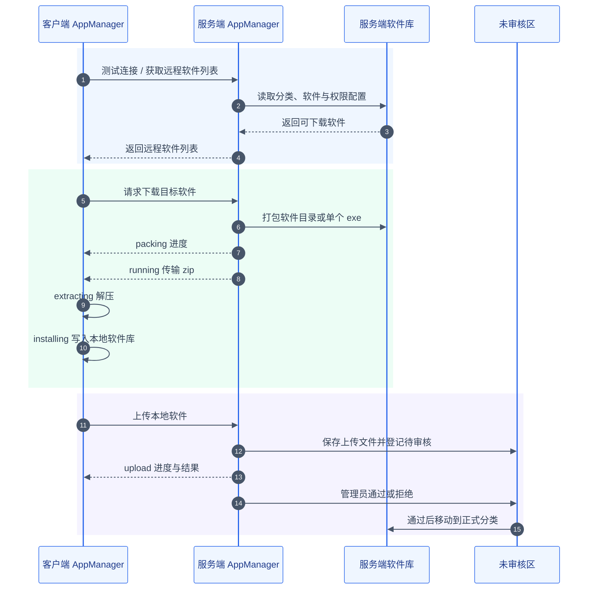

# AppManager

AppManager 是一个面向 Windows 的本地软件管理与启动工具。它可以把常用软件、绿色软件、便携工具集中放进一个本地软件库中，按分类管理、扫描、启动、收藏，也支持在局域网内以服务端/客户端模式传输软件包。

当前项目处于早期可用版本，适合个人或小团队在 Windows 设备之间整理、迁移和共享本地软件。

## 功能概览

- 本地软件库：启动后自动在程序目录旁创建 `AppManagerLibrary`。
- 分类管理：创建分类、删除分类，可选择是否同时删除真实文件夹。
- 软件扫描：扫描分类目录，识别 `.exe` 启动程序。
- 软件启动：在 AppManager 中直接启动已识别的软件。
- 收藏与搜索：收藏常用软件，按软件名、分类名、备注快速搜索。
- 软件维护：编辑软件名称、备注、图标、启动程序，移动软件到其他分类。
- 文件操作：打开软件目录、打开软件库目录。
- 开机自启：在设置中启用或关闭 Windows 开机自启。
- 局域网服务端：将当前设备作为软件服务端，提供软件列表、下载、上传审核。
- 局域网客户端：连接服务端，获取远程软件列表、下载软件、上传本地软件。
- 传输进度：下载时显示打包、下载、解压、安装等阶段进度。

## 软件预览

图片暂未提交到仓库。后续可以把截图放到 `docs/images/` 目录，并按下面的位置替换。

| 页面 | 图片位置建议 | 说明 |
| --- | --- | --- |
| 主界面 | `docs/images/main-window.png` | 分类、搜索、软件卡片 |
| 设置页 | `docs/images/settings.png` | 本地/服务端/客户端模式 |
| 远程软件 | `docs/images/remote-apps.png` | 服务端软件列表、上传下载进度 |
| 审核列表 | `docs/images/review-list.png` | 服务端审核客户端上传的软件 |

```md


```

### 主界面

主界面用于浏览本地软件库、切换分类、搜索软件、收藏软件和执行启动/打开目录/编辑/移动/上传等操作。

```md

```

### 设置页

设置页用于切换本地模式、服务端模式和客户端模式，配置服务端监听地址、客户端连接信息、开机自启等选项。

```md

```

### 远程软件与传输进度

远程软件页用于查看服务端软件列表，执行下载、上传，并展示打包、下载、解压、安装等传输阶段。

```md

```

### 服务端审核

服务端审核区用于处理客户端上传的软件，通过后会移动到软件库分类中，拒绝后会清理对应上传文件。

```md

```

## 架构预览

AppManager 由前端界面、Tauri 命令层、Rust 核心逻辑、本地软件库和局域网传输模块组成。前端负责状态展示和用户交互，Rust 后端负责文件扫描、软件启动、配置读写、内置 HTTP 服务和客户端传输。



### 本地模式流程



### 局域网传输流程



架构图片也可以后续手动导出成静态图，建议保存到：

```text
docs/images/architecture.png
docs/images/local-flow.png
docs/images/transfer-flow.png
```

如果后续要用 AI 生成一张更适合 README 首屏展示的架构海报，可以使用下面这段提示词。生成后建议保存为 `docs/images/architecture-ai.png`，再在本节顶部引用。

```text
Create a clean modern architecture diagram for a Windows desktop app named AppManager.
Style: polished technical documentation infographic, light theme, flat vector look, crisp labels, no 3D, no decoration.
Canvas: 16:9 landscape.
Show these modules: User, Frontend UI (Vite + JavaScript + CSS), Tauri Command Bridge, Rust Core, AppManagerLibrary, Apps folders, config/app-data.json, LAN Server Mode, LAN Client Mode, Remote AppManager.
Show the flow: User -> Frontend UI -> Tauri Bridge -> Rust Core -> Local Library; Rust Core also connects to Server Mode and Client Mode; Server/Client communicate with Remote AppManager over LAN.
Use readable boxes, grouped sections, blue for desktop layer, green for local storage, purple for LAN transfer, amber for user.
Text must be concise and legible. Avoid tiny text, shadows, gradients, watermarks, logos, or fake UI screenshots.
```

## 技术栈

- 桌面框架：[Tauri 2](https://v2.tauri.app/)
- 前端构建：[Vite](https://vite.dev/)
- 前端语言：HTML / CSS / JavaScript
- 后端语言：Rust
- 数据存储：本地 JSON 文件
- 传输方式：内置轻量 HTTP 服务，适用于局域网场景

## 环境要求

推荐环境：

- Windows 10 / Windows 11
- Node.js LTS
- Rust stable MSVC toolchain
- Microsoft C++ Build Tools，安装时选择 `Desktop development with C++`
- Microsoft Edge WebView2 Runtime

Tauri 官方环境说明见：

- [Tauri v2 Prerequisites](https://v2.tauri.app/start/prerequisites/)
- [Tauri v2 CLI](https://v2.tauri.app/reference/cli/)

## 快速开始

克隆项目：

```bash
git clone https://github.com/zhangjun2636808827/APPManager.git
cd APPManager
```

安装前端依赖：

```bash
npm install
```

启动开发版桌面应用：

```bash
npm run tauri dev
```

只构建前端：

```bash
npm run build
```

构建桌面安装包：

```bash
npm run tauri build
```

构建产物通常位于：

```text
src-tauri/target/release/
src-tauri/target/release/bundle/
```

## 使用说明

### 1. 本地模式

首次启动后，程序会在可执行文件所在目录下创建软件库：

```text
AppManager.exe
AppManagerLibrary/
  Apps/
  config/
    app-data.json
```

使用流程：

1. 点击“新建分类”，例如 `开发工具`、`办公软件`、`系统工具`。
2. 点击“打开软件库目录”。
3. 将软件文件夹或单个 `.exe` 放入对应分类目录。
4. 回到 AppManager，点击“扫描”。
5. 扫描完成后即可启动、收藏、编辑或移动软件。

示例目录：

```text
AppManagerLibrary/
  Apps/
    开发工具/
      VSCode/
        Code.exe
      Git/
        git-bash.exe
    系统工具/
      7-Zip/
        7zFM.exe
  config/
    app-data.json
```

### 2. 服务端模式

服务端模式用于把当前设备的软件库分享给同一局域网内的其他设备。

使用流程：

1. 进入“设置”。
2. 选择“服务端模式”。
3. 设置监听地址、端口、用户名、密码。
4. 按需开启“允许下载”。
5. 保存设置。
6. 在另一台设备的客户端模式中填写该设备 IP、端口、用户名和密码。

注意：

- 建议只在可信局域网内使用。
- 如果其他设备无法连接，请检查 Windows 防火墙是否允许该端口访问。
- 服务端上传的软件会进入未审核区域，需要在服务端手动通过或拒绝。

### 3. 客户端模式

客户端模式用于连接另一台 AppManager 服务端。

使用流程：

1. 进入“设置”。
2. 选择“客户端模式”。
3. 填写服务端 IP、端口、用户名、密码。
4. 点击“测试连接”。
5. 点击“获取服务端软件列表”。
6. 在远程软件列表中下载软件，或把本地软件上传到服务端。

下载流程包括：

```text
packing -> running -> extracting -> installing -> done
```

其中 `packing` 表示服务端正在打包软件，`running` 表示客户端正在接收文件。

对于体积很大、且包含大量小文件的软件，首次下载仍需要进行一次打包。打包完成后，服务端会把生成的 zip 缓存在：

```text
AppManagerLibrary/config/package-cache/
```

下次下载同一个软件时，如果文件数量、文件大小、修改时间和文件路径签名没有变化，会直接复用缓存包，跳过最耗时的重新打包阶段。如果软件目录发生变化，缓存会自动失效并重新打包。

如果缓存包占用空间过大，可以在“设置 -> 下载缓存”中查看缓存数量、占用空间，并一键清空下载缓存。清空缓存不会删除软件库中的真实软件文件，只会让下次下载时重新打包。

## 项目结构

```text
APPManager/
  docs/
    requirements.md        # 需求记录
    ui-design.md           # UI 设计记录
  src/
    main.js                # 前端交互、状态管理、Tauri 命令调用
    styles.css             # 界面样式
  src-tauri/
    capabilities/
      default.json         # Tauri 权限配置
    icons/
      icon.ico             # 应用图标
    src/
      lib.rs               # Rust 后端、文件扫描、传输服务、系统调用
      main.rs              # Tauri 入口
    Cargo.toml             # Rust 依赖配置
    tauri.conf.json        # Tauri 应用配置
  index.html               # Vite 入口页面
  preview.html             # 浏览器预览入口
  package.json             # 前端脚本和依赖
```

## 数据与目录

运行时数据不会提交到 Git，主要包括：

```text
AppManagerLibrary/
  Apps/                    # 软件分类与真实文件
  config/
    app-data.json          # 分类、软件、设置等本地数据
    icons/                 # 提取或缓存的软件图标
```

这些内容已经在 `.gitignore` 中忽略，避免把本地软件、配置密码、日志或构建产物误提交到仓库。

## 常见问题

### npm install 失败

请先确认 Node.js 和 npm 可用：

```bash
node -v
npm -v
```

如果网络较慢，可以配置 npm 镜像后重试。

### npm run tauri dev 失败

请确认 Rust 和 Tauri 所需的 Windows 构建环境已经安装：

```bash
rustc -V
cargo -V
```

Windows 上还需要 Microsoft C++ Build Tools 和 WebView2 Runtime。

### 客户端连接不上服务端

检查以下项目：

- 两台设备是否在同一局域网。
- 客户端填写的 IP 是否是服务端局域网 IP。
- 端口是否一致，默认端口是 `8765`。
- 用户名和密码是否一致。
- Windows 防火墙是否放行 AppManager 或对应端口。

### 下载一直停在打包阶段

软件较大时服务端需要先打包，打包阶段可能持续一段时间。可以观察进度条是否持续增长。如果进度长时间不变，请查看客户端日志和服务端日志。

### 中文出现乱码怎么办

项目文件应保持 UTF-8 编码。修改源码时不要使用会改写编码的工具批量保存文件。所有重要修改都应提交到 GitHub，必要时可以通过 Git 历史回退。

## 开发验证

修改代码后建议至少运行：

```bash
node --check src/main.js
cargo fmt --manifest-path src-tauri/Cargo.toml --check
cargo check --manifest-path src-tauri/Cargo.toml
npm run build
```

如果只修改 README 或文档，一般不需要重新构建程序，但仍建议检查 Git 状态后提交。

## Git 工作流

本项目已经提交到 GitHub：

[https://github.com/zhangjun2636808827/APPManager](https://github.com/zhangjun2636808827/APPManager)

推荐每次修改后都保留一个可回退节点：

```bash
git status --short --branch
git add .
git commit -m "说明本次修改内容"
git push
```

查看提交历史：

```bash
git log --oneline --decorate --graph --max-count=20
```

回退到某个历史版本前，建议先新建备份分支：

```bash
git branch backup-before-rollback
```

## 当前限制

- 当前主要面向 Windows 使用场景。
- 服务端/客户端传输适合可信局域网，不建议直接暴露到公网。
- 多 `.exe` 软件目录可能需要手动编辑启动程序。
- 仍处于早期版本，部分 UI 文案和异常提示还需要继续整理。

## 贡献

欢迎提交 Issue 或 Pull Request。建议提交前先说明问题场景、复现步骤、期望行为和系统环境。

如果要提交代码，请尽量保持：

- 修改范围清晰。
- 不提交 `AppManagerLibrary/`、`dist/`、`src-tauri/target/` 等运行和构建产物。
- 修改后运行必要的检查命令。
- 涉及文件读写、传输、删除操作时补充测试说明。

## License

本项目基于 [MIT License](LICENSE) 开源。
